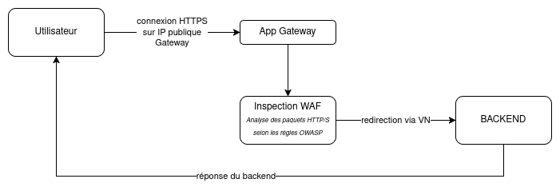
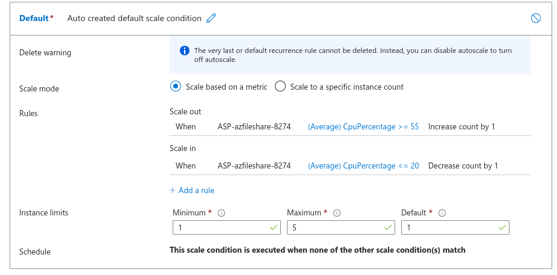

# COMPLEMENT TECHNIQUE

## Schéma d'architecture sécurisée

### Pourquoi App Gateway et pas Load Balancer ?

Le Load Balancer n'interprète pas le trafic HTTP.
Il ne peut pas bloquer une attaque par injection SQL ou gérer des certificats SSL.
L'Application Gateway centralise la gestion de la sécurité du trafic web et offre une visibilité totale sur les menaces. Celle-ci est donc nécessaire à la sécurité de l'application.

### Tests WAF :

Preuve de fonctionnement de l'endpoint :
![Schéma] (./docs/Preuve_health.png)

Injection 1 :
![Schéma] (./docs/Injection_SQL.png)

Injection 2 :
![Schéma] (./docs/Injection_XSS.png)

## Tests de charge

Pour une raison obscure le mode Rules-based pour le Scale Out refuse de s'activer et reste sur Automatique.

Les règles sont néamoins établies dans l'App Service Plan :

Le Scale Up est au forfait Premium V3 P0V3, avec 1 vCPU et 4Go de RAM.

## Estimation des coûts additionnels

Une application Gateway avec WAFv2 consomme ~0.42€ par heure.
Cela s'accumule à ~302€ par mois si activé constamment. C'est une ressource qui augmente largement la sécurité de l'application, mais qui est onéreuse.

La SQL Database d'Azure est de loin la ressource la plus onéreuse : ~409€/mois pour 720 heures actives avec tous les paramètres au minimum. On parle ici d'utilisation effective sur 720 heures, le tarif est pay-as-you-go, si la DB n'est pas sous utilisation constante ca reviendra probablement moins cher. 
